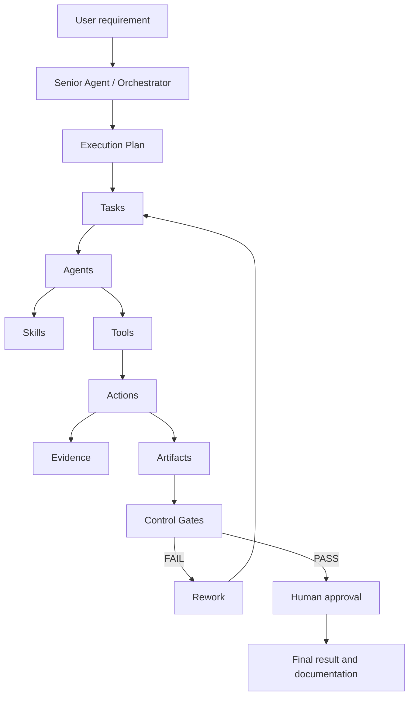
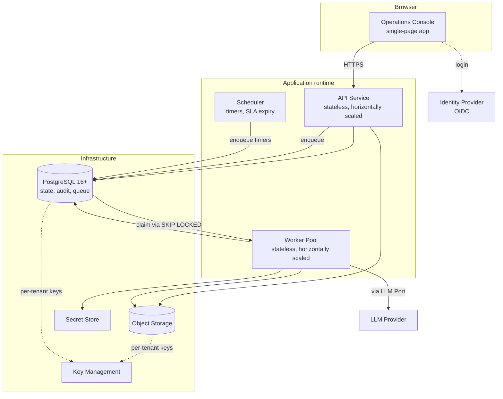
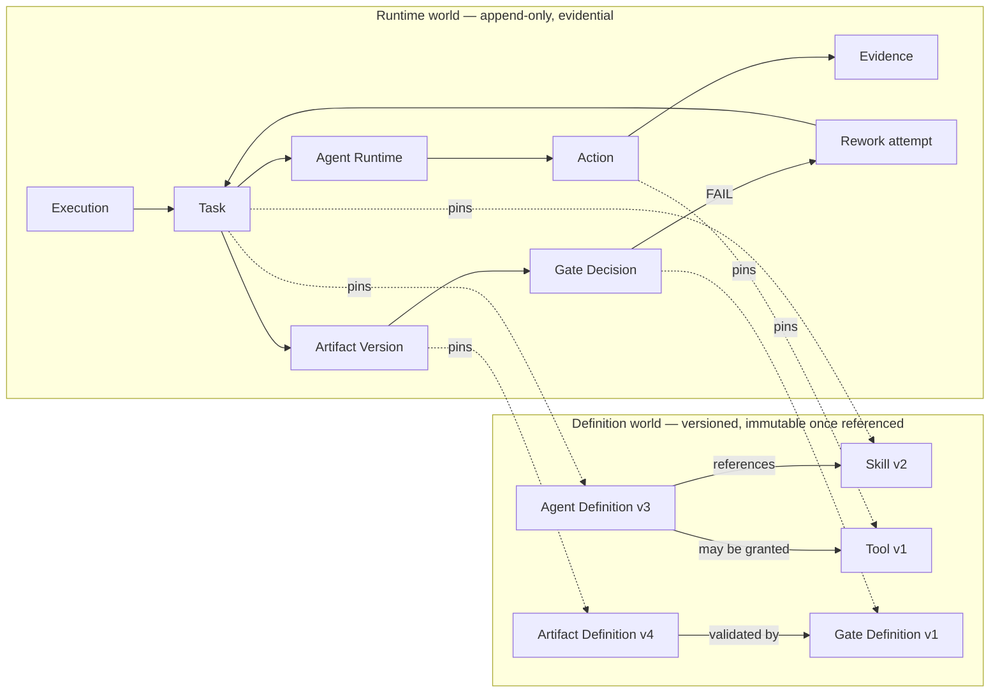
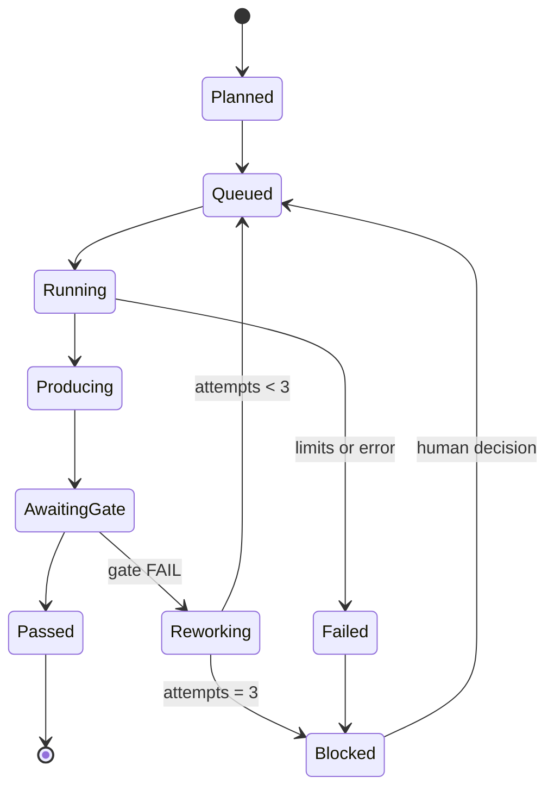
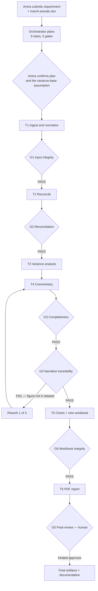
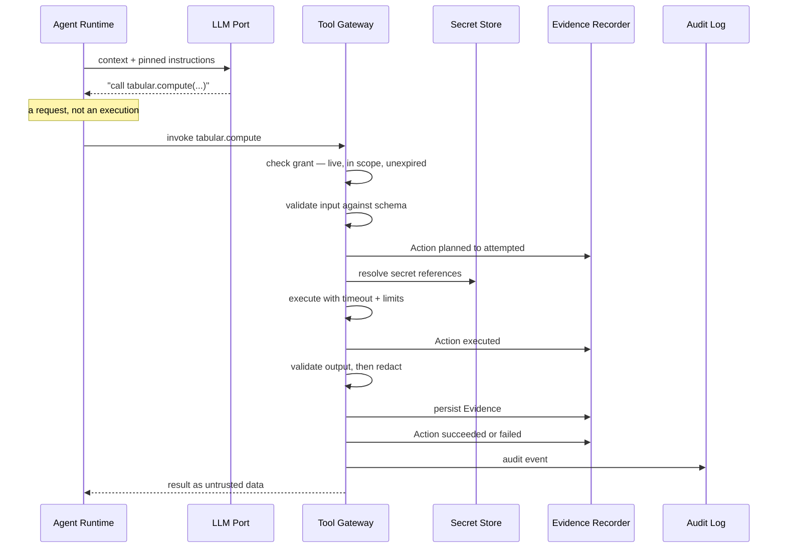
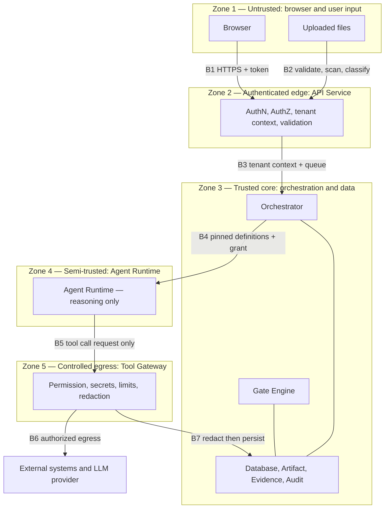
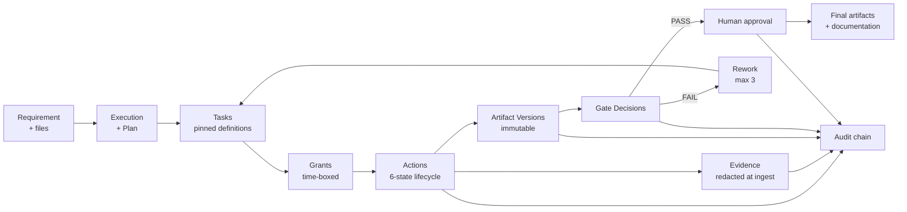

# ARCHITECTURE.md — AI Digital Workforce

How the system is built, from the mental model down to component boundaries.

**Authority.** `CLAUDE.md` owns engineering rules. `PRODUCT.md` owns scope. `docs/DECISIONS.md` owns
resolved decisions. This document owns **structure** — what the components are, what each is and is
not responsible for, and how they talk. It adds no product requirements.

**Deliberately not here.** No database tables. No code. No infrastructure vendor choices. Anything not
settled in `PRODUCT.md` or `DECISIONS.md` is marked **OPEN DECISION** rather than guessed; they are
collected in §29.

**Audience.** The development team. If a section cannot be implemented from its description, the
section is wrong.

---

## 1. The mental model

The conceptual chain the whole product is built to serve:



Read it as an org chart, not a pipeline. A manager receives a requirement, breaks it into
assignments, gives each worker the equipment and access that assignment needs, the worker produces
something, a supervisor checks it against a standard, and a human signs at the end. Every step leaves
a record.

## 2. The one-paragraph architecture

A **stateless API service** accepts requirements and serves the console. It writes an **Execution** to
the database and enqueues it. A **worker pool** picks it up and runs the **Orchestrator**, which plans
the work and drives a persisted state machine. For each task, the Orchestrator starts an **Agent
Runtime** — a short-lived instance bound to one pinned Agent Definition version and one time-boxed
permission grant. The Agent Runtime reasons via the **LLM Port** and *asks* to call tools; it never
calls them. Every tool call passes through the **Tool Gateway**, which is the only component that
checks permission, touches secrets, enforces limits, redacts, and records the **Action** and its
**Evidence**. Products of work become **Artifact** versions, which the **Gate Engine** validates
against **Artifact Definitions**. A failed gate triggers **Rework**; a passed final gate goes to the
**Approval Service** for a human signature. Everything that happened is written to a hash-chained
**Audit Log**. All of it is tenant-scoped at the database level.

**The single most important structural rule:** the Agent Runtime *proposes*, the Tool Gateway
*disposes*. The model can only ever emit a request; a separate component decides whether it happens.

## 3. Architectural invariants

These are derived from `CLAUDE.md` and `DECISIONS.md`, not invented here. Everything below must
preserve them.

| # | Invariant | Source |
|---|---|---|
| I1 | All execution state lives in the database. No workflow state exists only in memory. | `CLAUDE.md` §1; D7 (72-hour approvals outlive any process) |
| I2 | An LLM can request a tool call. It can never perform one. | D10, D13 |
| I3 | Nothing is written to evidence or artifacts before redaction. | D12 |
| I4 | Every task pins the exact versions of every definition it used. | D9 |
| I5 | The producer of an artifact can never decide the gate covering it. | D4 |
| I6 | Artifact versions are immutable. Update means new version. | `CLAUDE.md` §3 |
| I7 | Every tenant-owned read and write is constrained at the database level. | D15 |
| I8 | Audit records are append-only and hash-chained. | D14 |
| I9 | A permission grant is scoped to one task and expires. | D10 |
| I10 | Success is never displayed or recorded without linked evidence. | `CLAUDE.md` §3 |
| I11 | The chain sequence number, not the timestamp, is the authoritative order of events. | D21 |
| I12 | A chain record's hash covers the ciphertext digest and metadata, never plaintext, so verification survives key destruction. | D1, D20 |
| I13 | Three structures sit outside tenant scope: the dispatch queue and the chain-head read used for anchoring, both carrying identifiers and hashes only and never business content; and the platform-curated definition tables, which hold no tenant data at all. Every other table is tenant-scoped without exception. | D17, D18, D20, D30 |

## 4. Process and deployment view

Three runtime processes and five infrastructure dependencies. Deliberately small.



The API service and the worker pool share the same domain code but expose different entry points. The
scheduler exists only to turn time into queue messages — SLA expiry, budget windows, retention sweeps.

Per D17 and D19 there is **no message broker**: the queue is a PostgreSQL table claimed with
`SELECT … FOR UPDATE SKIP LOCKED`. Three processes, three infrastructure dependencies.

**OPEN DECISION:** whether the scheduler is a separate process or a leader-elected role inside the
worker pool.

---

## 5. The domain model

The most important section in this document. These are **conceptual entities**, not tables — table
design is deliberately deferred.

### 5.1 Two worlds: definitions and runtime

Everything in the system belongs to one of two worlds, and confusing them is the most common way this
architecture gets built wrong.

- **The definition world is versioned, immutable once referenced, and slow-moving.** It describes what
  *should* happen: Agent Definitions, Skills, Tools, Artifact Definitions, Control Gate Definitions.
- **The runtime world is append-only, evidential, and fast-moving.** It records what *did* happen:
  Executions, Tasks, Agent Runtimes, Actions, Evidence, Artifact Versions, Gate Decisions, Rework
  attempts.

The bridge between them is **pinning** (I4): every runtime object records the exact definition
version that governed it.



### 5.2 Agent, Agent Definition, Agent Runtime

The triad that most needs to be understood. `PRODUCT.md` §7's employment metaphor makes it concrete:

| Concept | Employment analogy | Lifetime | Mutable? |
|---|---|---|---|
| **Agent** | The position — "Variance Analyst" | Permanent | Identity never changes |
| **Agent Definition** | The job description, revision 3 | Versioned | Immutable once referenced |
| **Agent Runtime** | The person working one shift, holding one badge | One task | Ephemeral, dies at task end |

- An **Agent** is a named role with durable identity. It is what appears in the console as "who did
  this," and it persists across configuration changes.
- An **Agent Definition** is the versioned configuration of that role: instructions, which Skills it
  is trained in, which Tools it *may* be granted, its inputs, outputs, and completion criteria. New
  configuration produces a new version; existing executions keep pointing at the old one.
- An **Agent Runtime** is one instance executing one Task, bound to exactly one Agent Definition
  version and exactly one permission grant. It holds no state after the task ends. Two tasks running
  the same Agent Definition concurrently are two independent runtimes with independent grants.

### 5.3 Skill, Tool, Tool Permission

The separation here is a security mechanism, not taxonomy.

- A **Skill** is versioned instruction content — how to do a class of work. It is data that shapes
  reasoning. **A Skill grants nothing.**
- A **Tool** is a capability implementation with a declared input schema, output schema, timeout, and
  resource limits. It is the only way to touch anything outside the process.
- A **Tool Permission Grant** binds `{task, tool, scope, expiry}`. It is created when a task starts and
  revoked when it ends (I9, D10).

**Why the separation matters:** an Agent Definition may *declare* that its role needs `spreadsheet.read`,
but declaring is not granting. Capability arrives only through a grant issued by the Orchestrator and
enforced by the Tool Gateway. Because instruction can never confer capability, content that reaches an
agent's context — including hostile content smuggled inside a spreadsheet — cannot escalate privilege.
It can at most misuse what was already granted, and that is bounded, time-boxed, and recorded.

### 5.4 Action and Evidence

- An **Action** is one tool invocation within a Task, carrying the six-state lifecycle from
  `CLAUDE.md` §3: `planned → attempted → executed → succeeded | failed`, plus `unverified` for a
  reported completion with no evidence.
- **Evidence** is the recorded proof attached to an Action: exit status, response payload, row counts,
  file hashes, durations, external system IDs. It is immutable, redacted before persistence (I3), and
  attaches to exactly one Action or one Gate Decision.

An Action without Evidence can never reach `succeeded` (I10). This is enforced in the recorder, not
in prompt instructions.

### 5.5 Artifact and Artifact Definition

- An **Artifact** is a business work product with durable identity and an ordered list of immutable
  **Artifact Versions**.
- An **Artifact Definition** is the versioned contract: what fields the artifact must contain, what
  validations apply, and which Control Gates cover it.
- Every Artifact Version records which Artifact Definition version validated it (I4). "Updating" an
  artifact always means appending a new version (I6).

### 5.6 Control Gate, Rework, Execution

- A **Control Gate** is a checkpoint bound to an artifact or task. Its **Gate Definition** is versioned;
  its **Gate Decision** is a runtime record naming the verdict, the deciding identity, the timestamp,
  the artifact version judged, and the rule that produced it.
- **Rework** is the controlled loop after a FAIL: the task reopens with the failure attached, the
  attempt counter increments, and at 3 attempts (D11) the task pauses into Needs Attention.
- An **Execution** is one run of one requirement for one tenant. It is the root of everything above
  and the unit of budget, audit, and delivery.

### 5.6a Chain Record and Anchor Record

Two runtime-world entities that describe rather than govern. Neither is ever pinned, because neither
constrains behaviour — they record it.

- A **Chain Record** is one entry in a tenant's audit chain. It carries the tenant identity, a
  per-tenant sequence number, the previous record's hash, the event metadata, the hash algorithm
  identifier (D24), the encryption key identifier (D25), and the digest of the encrypted payload. Its
  own hash is computed over the JCS-canonicalized header (D23) — never over plaintext (I12).
- An **Anchor Record** is one entry in the platform-wide anchor chain. It carries a tenant identity, that
  tenant's chain sequence and head hash at anchoring time, and a link to the previous anchor record
  **across all tenants**. Anchor records are mutually entangled, which is what makes truncation and
  wholesale rewrite of any single tenant's history detectable.

A reserved **platform chain** holds events belonging to no tenant — configuration changes, tenant
provisioning, break-glass access — and is anchored identically. A cross-boundary event is written to
both chains, and the platform-chain copy carries metadata only, never tenant content, so that shredding
a tenant key cannot leave that tenant's data readable elsewhere.

### 5.7 Cardinality summary

| Relationship | Cardinality |
|---|---|
| Tenant → Execution | 1 : many |
| Execution → Task | 1 : many |
| Task → Agent Definition version | many : 1 (pinned) |
| Task → Agent Runtime | 1 : 1 per attempt |
| Task → Tool Permission Grant | 1 : many |
| Task → Action | 1 : many |
| Action → Evidence | 1 : many |
| Task → Artifact Version | 1 : many (produces) |
| Artifact → Artifact Version | 1 : many, ordered, immutable |
| Artifact Version → Gate Decision | 1 : many |
| Gate Decision → Rework attempt | 1 : 0..1 |
| Task → Rework attempt | 1 : 0..3 |

### 5.8 Task lifecycle



Every transition is a persisted event (I1) and an audit record (I8).

---

## 6. The worked example

One example runs through the rest of this document.

> **Amira (FP&A Analyst) submits:** *"Analyze this monthly financial Excel file, identify important
> variances, create charts, update the workbook, and generate a PDF report."*
> **Attached:** `march-actuals.xlsx`

### 6.1 Two scope observations, flagged not resolved

The example is a good architectural test precisely because it does not fit MVP scope cleanly. Both
gaps are recorded rather than designed around.

1. **"Update the workbook" — resolved by D22, but not as asked.** `PRODUCT.md` §11 fixed a six-tool MVP
   set with no `spreadsheet.write`. D22 adds one, scoped to **composing a new workbook from validated
   structured data**; in-place modification of an uploaded workbook is excluded from MVP, and the
   uploaded file stays immutable. The example therefore produces a *new* derived workbook artifact
   rather than a v2 of the upload. *Note this was never a violation of the read-only rule:* producing a
   versioned artifact inside the platform is artifact production, not a write to an external business
   system. `PRODUCT.md` §11 and §8.3 are stale until amended.
2. **"Important variances" has no stated comparison base.** The MVP Finance workflow compares actuals
   to budget (`PRODUCT.md` §8.1), but only one file is attached. Variance could mean against budget,
   against prior period, or against forecast. The architecture does not guess — the Orchestrator
   surfaces the ambiguity as a stated assumption in the plan, and the human resolves it at plan
   confirmation, which is the cheapest correction point in the system.

The example below assumes Amira confirms "against the budget columns in the same workbook." The tool
question is resolved by D22, on the new-workbook-only terms described above.

### 6.2 The plan the Orchestrator produces

Execution `E-1042`, tenant `T-7`, requester Amira.

| Task | Agent | Tools granted | Produces | Gates |
|---|---|---|---|---|
| T1 | Data Preparation | `artifact.read`, `spreadsheet.read`, `tabular.transform` | `dataset.normalized` v1 | G1 Input integrity |
| T2 | Reconciliation | `tabular.compute` | `reconciliation.report` v1 | G2 Reconciliation |
| T3 | Variance Analysis | `tabular.compute` | `variance.table` v1 | — |
| T4 | Commentary | `artifact.read` | `variance.commentary` v1 | G3 Completeness, G4 Traceability |
| T5 | Report Assembly | `chart.render`, `spreadsheet.write` | `march-variance-pack.xlsx` v1 *(new artifact)* | G6 Workbook integrity |
| T6 | Report Assembly | `document.render` | `report.pdf` v1 | G5 Final review *(human)* |



The G4 failure is not decoration. It is the platform's whole thesis in one step, and §21 traces it.

---

## 7. Frontend — Operations Console

**What it is.** A single-page web application implementing `DESIGN.md`. It is a *view over the record*,
not a place where business logic lives.

**Why we need it.** The eight questions in `DESIGN.md` §2 are the product's user-facing contract. A
compliance officer must be able to see what was planned, what ran, what it produced, what the gate
decided, and what the evidence was — without asking an engineer.

**Responsible for.** Rendering execution state, timelines, action ledgers, artifact registers and
previews, gate stamps, and the Needs Attention queue · plan confirmation · file upload · gate decision
capture · presenting redacted content exactly as the server sends it · accessibility per `DESIGN.md`
§16.

**NOT responsible for.** Any authorization decision — it hides what the user cannot use, but the server
decides · redaction · any business rule · deriving state the server did not send · optimistic rendering
of real business actions, which `DESIGN.md` §15.1 prohibits.

**Communicates with.** API Service over HTTPS. Identity Provider for login. Nothing else — the frontend
never contacts object storage, the LLM, or any tool directly.

**OPEN DECISION B:** frontend framework and build tooling.
**OPEN DECISION C:** live-update transport — server-sent events, WebSocket, or interval polling. The
requirement is fixed at 2-second visibility (`PRODUCT.md` §22); the mechanism is not.

## 8. Backend / API Service

**What it is.** A stateless HTTP service. The only write path into the system and the only read path
out of it.

**Why we need it.** A single, uniform place to enforce authentication, authorization, tenant scoping,
validation, and audit on everything entering or leaving.

**Responsible for.** Terminating HTTPS · verifying identity tokens · establishing tenant context for
every request · enforcing user-level authorization · validating request payloads · issuing upload
credentials and accepting file ingest · creating Executions and enqueuing them · serving all record
views · recording gate decisions submitted by humans · emitting audit events for every state-changing
call.

**NOT responsible for.** Running agents · calling tools · calling the LLM · deciding gates · long-running
work of any kind. Any request that would take longer than a normal HTTP timeout becomes a queued job.

**Communicates with.** Frontend · Database · Object Storage · Queue · Identity Provider · Audit Log.

**Implementation** (D16). Python 3.12 with FastAPI and Pydantic v2. Pydantic models validate every
request at boundary B1 and B2 — a security control, not a convenience.

## 9. Senior Agent / Orchestrator

**What it is.** The component that turns a requirement into a plan and then drives that plan to
completion. It is the Senior Agent of `CLAUDE.md` §1, and it is a **persisted state machine**, not a
long-lived in-memory process.

**Why we need it.** Someone must decompose work, assign it, grant only what each assignment needs,
sequence gates, route failures, and decide when the whole thing is done. That is a distinct
responsibility from doing the work.

**Responsible for.** Understanding the requirement and producing the Execution Plan · surfacing
assumptions and ambiguities for human confirmation · creating Tasks and pinning definition versions
(I4) · requesting permission grants scoped to each task · sequencing tasks and their dependencies ·
starting Agent Runtimes · invoking the Gate Engine at checkpoints · routing FAIL verdicts to the Rework
Controller · enforcing execution-level budgets and limits · performing the final verification pass over
recorded evidence (`CLAUDE.md` §1 step 10) · triggering final documentation generation.

**NOT responsible for.** Calling tools · deciding gate verdicts · producing artifacts · holding
secrets · deciding what a *human* approves · keeping state in memory between steps.

**Communicates with.** Queue (in and out) · Database (all state) · Agent Runtime · Gate Engine · Rework
Controller · Approval Service · Audit Log · LLM Port (for planning only).

**Note on step 10.** The Orchestrator's verification pass re-reads recorded evidence; it never asks an
agent whether it finished. An agent's self-report is not an input to this check.

**Implementation** (D17). A database-driven state machine with a PostgreSQL queue — no workflow engine
and no broker. Every state transition and its audit record are written **in the same transaction**, so a
transition and its audit entry can never diverge. Task handlers are idempotent, keyed on
`{task, attempt, step}`. Per-tenant concurrency limits prevent one tenant's close week from starving
another.

## 10. Agent Runtime

**What it is.** A short-lived executor for exactly one Task, bound to one pinned Agent Definition
version and one permission grant.

**Why we need it.** Reasoning must happen somewhere with a hard boundary around it. The runtime is the
blast-radius container: what it can do is exactly what its grant allows, and it ceases to exist when
the task ends.

**Responsible for.** Assembling the model context from pinned instructions, pinned Skill content, task
inputs, and referenced artifact content · marking all external content as untrusted data, separated
from instructions (D13) · calling the LLM Port · interpreting the model's response as a *request* to
call a tool · submitting that request to the Tool Gateway · looping until the pinned completion criteria
are met or a limit trips · reporting task outcome to the Orchestrator.

**NOT responsible for.** Authorizing anything · resolving or seeing secrets · executing tools · writing
Actions, Evidence, or Artifacts directly · deciding gates · persisting its own state · surviving the
task.

**Communicates with.** Orchestrator · LLM Port · Tool Gateway. **Nothing else.** It has no database
credentials, no object storage credentials, and no network egress of its own.

That last constraint is the point. The Agent Runtime is the least-trusted component in the system and
is wired accordingly.

## 11. Task system

**What it is.** The unit of assignment and the unit of permission. Every Task carries the state machine
in §5.8.

**Why we need it.** Tasks are what make permission grants small, rework local, and progress legible.
Without them, an execution is an opaque blob.

**Responsible for.** Holding its pinned definition versions · its inputs and expected outputs · its
completion criteria · its lifecycle state and transition history · its rework attempt counter · its
grants, actions, and produced artifact versions.

**NOT responsible for.** Deciding its own completion · authorizing its own tools · deciding gates on
its own output.

**Communicates with.** Orchestrator (owns transitions) · Agent Runtime (executes it) · Gate Engine
(judges its output) · Rework Controller.

## 12. Skill system

**What it is.** A registry of versioned instruction content, referenced by Agent Definitions.

**Why we need it.** So that "how to write a variance commentary" is authored once, versioned, and
auditable — rather than embedded in prompts scattered through the codebase.

**Responsible for.** Storing and versioning Skill content · resolving the pinned version for a task ·
recording which Skill versions shaped which task.

**NOT responsible for.** Granting any capability whatsoever (D10) · executing anything · knowing about
tools beyond naming them descriptively.

**Communicates with.** Agent Definition registry · Agent Runtime (read-only, at context assembly).

**OPEN DECISION F:** how definitions and skills are authored and stored — version-controlled files
shipped with the platform, or database records with an authoring surface. `PRODUCT.md` D5 fixes
*who* may author them in MVP, not *where they live*.

## 13. Tool system

**What it is.** Two parts. The **Tool Registry** holds versioned tool descriptors — name, input schema,
output schema, timeout, resource limits, required scopes. The **Tool Gateway** is the single runtime
chokepoint through which every invocation passes.

**Why we need it.** It is the security boundary of the entire platform. Everything dangerous —
permission, secrets, external contact, limits, redaction — is concentrated in one component so that it
can be reviewed once and enforced everywhere.

**Responsible for.** Verifying a live, in-scope, unexpired permission grant for `{task, tool}` ·
validating input against the tool schema · recording the Action lifecycle transitions · resolving
secret *references* to values internally · enforcing timeouts and resource limits · executing the tool ·
validating output against the schema · **redacting before anything is persisted (I3)** · writing
Evidence · returning results to the runtime as untrusted data · emitting audit events.

**NOT responsible for.** Deciding *what* should be called — that is the runtime's proposal and the
Orchestrator's grant · business meaning of results · gate verdicts · artifact versioning semantics.

**Communicates with.** Agent Runtime (inbound requests) · Secret Store · Evidence Recorder · Artifact
Service · Audit Log · external systems, in later phases.



Note the order in the diagram: **redaction precedes persistence**, always.

## 14. Action recording

**What it is.** The component that writes the six-state Action lifecycle.

**Why we need it.** It is the mechanical implementation of `CLAUDE.md` §3. The distinction between
"we planned to," "we tried," "it ran," and "it worked" is the product's core claim, and it only exists
if something records it as distinct states.

**Responsible for.** Persisting each transition with its timestamp and actor · linking Actions to their
Task and their Evidence · refusing to mark `succeeded` without linked evidence (I10) · marking a
reported-but-unevidenced completion as `unverified`.

**NOT responsible for.** Deciding whether a result is *business-correct* — that is the Gate Engine ·
retrying · interpreting payloads.

**Communicates with.** Tool Gateway (sole writer) · Database · Audit Log · read by the API for the
action ledger.

**OPEN DECISION G:** idempotency strategy. A retried tool call must not double-execute a real-world
action. Neither `PRODUCT.md` nor `DECISIONS.md` settles this, and it becomes critical the moment
external writes arrive.

## 15. Artifact system

**What it is.** The service that owns artifact identity, versioning, and content.

**Why we need it.** Artifacts are the deliverable. Their immutability and lineage are what make the
record defensible.

**Responsible for.** Creating artifacts and appending versions · storing content in object storage,
content-addressed, under tenant-prefixed keys with per-tenant keys · recording producing task,
producing agent identity, timestamp, size, and checksum · recording which Artifact Definition version
validated each version · serving version history and diffs · enforcing that no version is ever mutated
or deleted (I6).

**NOT responsible for.** Validating business content — that is the Gate Engine · rendering previews,
which is the frontend's job over data this service supplies · deciding what should be produced.

**Communicates with.** Tool Gateway and Agent Runtime (via the gateway) for writes · Gate Engine ·
Object Storage · Database · API Service.

## 16. Artifact Definition system

**What it is.** The registry of versioned artifact contracts.

**Why we need it.** A gate needs something to check against. An artifact type with no definition
cannot be validated, and therefore cannot pass a gate.

**Responsible for.** Storing and versioning artifact schemas and validation rules · declaring which
Control Gates cover each artifact type · resolving the pinned definition version for a task.

**NOT responsible for.** Executing validation — it declares rules; the Gate Engine runs them · storing
artifact content.

**Communicates with.** Gate Engine · Artifact Service · Orchestrator (at planning, to know what gates
a plan implies).

## 17. Control Gate system

**What it is.** The Gate Engine — the component that produces verdicts.

**Why we need it.** It is the mandatory checkpoint. It is also, per D13, the primary compensating
control against prompt injection: an injected instruction cannot persuade a deterministic check to
pass.

**Responsible for.** Loading the pinned Gate Definition · running deterministic evaluators against the
artifact version and its evidence · routing human gates to the Approval Service · **enforcing that the
approver identity is not the producer identity (I5)** · recording a Gate Decision containing verdict,
deciding identity, timestamp, artifact version, and the rule applied · marking probabilistic checks as
model-assessed and distinct from deterministic ones · emitting the FAIL signal to the Rework Controller.

**NOT responsible for.** Fixing anything · producing artifacts · deciding *whether* a gate exists —
that comes from the Artifact Definition · overriding a human verdict.

**Communicates with.** Orchestrator · Artifact Service · Evidence Store · Approval Service · Rework
Controller · Audit Log.

**OPEN DECISION H:** whether deterministic evaluators run as an in-process library inside workers or as
an isolated evaluation service. The isolation argument grows stronger once tenant-authored departments
arrive post-MVP.

## 18. Evidence system

**What it is.** The recorder and store for proof.

**Why we need it.** Without it, every claim in the product is an assertion. `CLAUDE.md` §3 makes
evidence the difference between a record and a story.

**Responsible for.** Accepting evidence only from the Tool Gateway and the Gate Engine · **redacting
secrets and Restricted-class data before persistence (I3, D12)** · storing small evidence inline and
large evidence as encrypted blobs · computing and storing content hashes · linking evidence to exactly
one Action or Gate Decision · enforcing immutability.

**NOT responsible for.** Deciding what evidence *means* · re-redacting at read time, which D12
explicitly rejects as a strategy · retaining anything past its retention window.

**Communicates with.** Tool Gateway · Gate Engine · Database · Object Storage · Key Management.

**OPEN DECISION I:** the size threshold at which evidence moves from inline storage to blob storage.

## 19. Rework system

**What it is.** The controller that turns a FAIL verdict into a bounded retry.

**Why we need it.** Failure must be a first-class, visible, counted path — not an invisible retry loop.

**Responsible for.** Receiving FAIL verdicts · incrementing the task's attempt counter · attaching the
specific failure detail to the reopened task so the agent knows what to fix · re-queuing the task ·
**pausing to Needs Attention at 3 attempts (D11)** · recording every attempt so `DESIGN.md` §12.1 can
render "Rework 2 of 3."

**NOT responsible for.** Deciding *why* something failed · modifying artifacts · bypassing a gate ·
retrying transient infrastructure errors, which are a different concern handled at the tool layer.

**Communicates with.** Gate Engine · Orchestrator · Task system · Approval Service (on limit breach) ·
Audit Log.

**OPEN DECISION J:** whether human rejection at a gate consumes the same 3-attempt budget as a
deterministic failure. `DECISIONS.md` D11 leaves this open, and the two are arguably different signals.

## 20. Human approval

**What it is.** The Approval Service — human gates, SLA timers, escalation, and the Needs Attention
queue.

**Why we need it.** D6 makes a human final gate mandatory for every execution. It is the backstop that
does not depend on the model behaving.

**Responsible for.** Creating approval items with everything a reviewer needs — artifact version, what
it was checked against, who produced it, what changed since the previous version · notifying eligible
approvers · **enforcing that the requester and the producer are never eligible (I5, D4)** · running the
72-hour SLA (D7) · on expiry, moving the execution to Needs Attention and **never** treating expiry as
approval · recording explicit, audited escalation · capturing the verdict with a real attributable
human identity · governing waivers more strictly than approvals.

**NOT responsible for.** Deciding on a human's behalf · auto-approving under any circumstance · deciding
deterministic gates.

**Communicates with.** Gate Engine · Scheduler (timers) · API Service (verdict capture) · Notification ·
Audit Log.

## 21. Audit system

**What it is.** The append-only, hash-chained record of everything that happened (D14).

**Why we need it.** It is the product. If it is not trustworthy, nothing else matters.

**Responsible for.** Recording every action, permission grant and revocation, gate decision, artifact
version, waiver, delegation, configuration change, and data access · chaining each record to its
predecessor so alteration is detectable · attributing every entry to actor, tenant, trusted timestamp,
and the definition versions in force · supporting machine-readable export for external auditors ·
providing chain verification.

**NOT responsible for.** Operational debugging, which belongs to Observability (§27) · being writable or
deletable through the application (D14) · storing plaintext tenant payloads, which would defeat
crypto-shredding (D1) — payloads are encrypted per tenant, the chain links over hashes and metadata.

**Communicates with.** Every component, write-only · Database · Key Management · API Service, read-only
for the `auditor` role.

**NOT responsible for** (continued). Establishing event order from timestamps — order comes from the
chain sequence (I11).

### 21.1 Chain structure

Settled by D20, D21, and D23–D25.

**Tenant chains.** Each tenant has an independent chain with its own sequence number and head record.
Appends serialize on that tenant's head row, so write contention is scoped to one tenant and one
tenant's close week cannot slow another's audit writes — which matters because under D17 a state
transition and its audit record share a transaction, making chain contention into transition
contention.

**Hash input**, canonicalized per RFC 8785 (D23) with binary values as lowercase hex:

```
record_hash = H( prev_hash ‖ tenant_id ‖ seq ‖ event_type ‖ actor_id ‖ event_time ‖ H(payload_ciphertext) )
```

Every input survives key destruction, so verification outlives erasure (I12). Each record also stores
its `hash_algorithm` identifier (D24) and the encryption key identifier for its payload (D25).

**Anchor chain.** On a fixed cadence the scheduler writes one anchor record per active tenant holding
that tenant's current sequence and head hash. Anchor records chain to each other **across all tenants**,
so rewriting one tenant's history past its last anchor requires rewriting every subsequent anchor
including other tenants'. This is what detects truncation and wholesale rewrite, which plain chaining
does not. The anchor chain is **not tenant-readable**; access is restricted to platform and `auditor`
roles.

**Platform chain.** A reserved chain for events with no tenant, anchored identically. Cross-boundary
events such as break-glass access are written to both the platform chain and the affected tenant's
chain, with the platform copy carrying metadata only.

**Time.** Event time is PostgreSQL `transaction_timestamp()`; application hosts never supply a platform
timestamp. A monotonicity assertion at append records backwards time movement as an integrity anomaly.

**The anchoring read is one of the two sanctioned cross-tenant paths (I13).** It runs under a separate,
narrowly-privileged database role permitted to read chain-head hashes only — never payloads, never
business data. It is a permanent capability, not break-glass, and carries its own test coverage.

**OPEN DECISION:** anchor cadence · whether anchor records store `tenant_id` or a salted pseudonym ·
when external notarization of anchor heads is adopted · the platform chain's encryption key source.

## 22. Authentication

**What it is.** Identity verification via an external OIDC provider (`PRODUCT.md` §20).

**Why we need it.** Approval records need real, attributable humans. Identity cannot be a platform
invention.

**Responsible for.** Redirecting to the identity provider · validating tokens and signatures · mapping
external identity to a platform user within a tenant · session lifetime · enforcing MFA for `reviewer`,
`department_owner`, and `platform_admin` (`PRODUCT.md` §23).

**NOT responsible for.** Deciding what a user may do — that is Authorization · storing passwords ·
agent identity, which is a different mechanism entirely (§23).

**Communicates with.** Identity Provider · API Service · Audit Log.

## 23. Authorization

**What it is.** Two distinct systems that are easily and dangerously conflated.

| | **User authorization** | **Agent authorization** |
|---|---|---|
| Subject | A human | An Agent Runtime |
| Mechanism | Role-based, per `PRODUCT.md` §4 | Time-boxed permission grant per task |
| Enforced at | API Service, every request | Tool Gateway, every invocation |
| Lifetime | Session | One task |
| Question answered | "May this person do this?" | "May this task use this tool, in this scope, now?" |

**Why we need both.** A human's authority and an agent's capability are different things with different
lifetimes and different failure modes. Merging them would mean an agent inherits its requester's
authority — which is exactly the confused-deputy vulnerability the design must prevent.

**Responsible for.** User side: role checks, department scoping, the separation-of-duties rule that
`platform_admin` is not a superset of `reviewer`. Agent side: grant issuance by the Orchestrator, grant
validation by the Tool Gateway, expiry, and revocation at task end.

**NOT responsible for.** Authentication · hiding UI elements, which is presentation, not enforcement ·
allowing a Skill to confer capability (D10).

**Communicates with.** API Service · Tool Gateway · Orchestrator · Database · Audit Log.

## 24. Tenant isolation

**What it is.** Database-level enforcement that no tenant can read or write another's data, failing
closed on ambiguity (D15).

**Why we need it.** It is the least reversible decision in the system. Application-layer filtering makes
a single missing predicate a breach.

**Responsible for.** Carrying tenant identity on every tenant-owned record · constraining every query at
the database level · establishing tenant context from the authenticated session · **propagating tenant
context into queue messages, workers, and scheduled jobs**, which is the single most common source of
isolation bugs · tenant-prefixed object storage keys with per-tenant encryption keys · denying on absent
or ambiguous context · a permanent adversarial test suite (`PRODUCT.md` §14).

**NOT responsible for.** Authorization within a tenant · being optional for any store. Caches, search
indexes, and derived stores sit outside the database and need explicit treatment, or the guarantee is
only partial.

**Communicates with.** Every component that touches data.

**Mechanism** (D18). Shared schema with PostgreSQL row-level security: `ENABLE` and `FORCE ROW LEVEL
SECURITY` on every tenant-owned table, an application role that is not a superuser, is not the table
owner, and does not hold `BYPASSRLS`, and tenant context set **per transaction** rather than per session
because of connection pooling.

**The two sanctioned exceptions** (I13), both carrying identifiers and hashes only and never business
content: the platform-scoped dispatch queue (§28) and the chain-head read performed by the anchoring
role (§21.1). Both are permanent capabilities rather than break-glass, and both belong in the
adversarial isolation suite.

Migration to database-per-tenant remains available later for a specific regulated customer, because the
schema is identical.

## 25. Database

**What it is.** The system of record for all execution state, definitions, actions, evidence metadata,
artifact metadata, gate decisions, and audit records.

**Why we need it.** Invariant I1 — if it is not in the database, it did not happen in a way this
platform accepts.

**Responsible for.** Durable, transactional state · enforcing tenant isolation at the data layer ·
enforcing append-only semantics for audit, evidence, and artifact versions · supporting the ordered
reads the console needs.

**NOT responsible for.** Storing artifact or large evidence *content*, which lives in object storage ·
business logic · being reachable from the Agent Runtime.

**Communicates with.** API Service · Workers · Scheduler. Not the Agent Runtime, and never the browser.

**Engine: PostgreSQL 16+** (D19). It serves four distinct needs at once — row-level security for D18's
isolation, JSONB for evidence payloads and pinned definition snapshots, `SELECT … FOR UPDATE SKIP
LOCKED` for D17's queue, and declarative partitioning for evidence and audit growth. One component
instead of three.

Required configuration: `ENABLE` **and** `FORCE ROW LEVEL SECURITY` on every tenant-owned table; the
application role is not a superuser, is not the table owner, and does not hold `BYPASSRLS`; tenant
context is set per transaction, never per session, because of connection pooling.

**The database host's clock is a platform dependency, not an incidental detail** (D21): disciplined with
slewing rather than stepping, monitored for offset, and the observed offset periodically recorded as a
platform audit event so an auditor can see the clock was under discipline throughout.

## 26. File and object storage

**What it is.** Content storage for uploaded files, artifact version content, and large evidence blobs.

**Why we need it.** Content is large, immutable, and content-addressable — a poor fit for the relational
store.

**Responsible for.** Storing immutable content addressed by hash · tenant-prefixed key layout ·
encryption with per-tenant keys so that key destruction renders content unreadable (D1) · serving
content only through short-lived, scoped credentials issued by the API.

**NOT responsible for.** Access control decisions · versioning semantics, which the Artifact Service
owns · redaction, which happened before anything arrived here (I3).

**Communicates with.** API Service · Artifact Service · Evidence Recorder · Key Management.

## 27. LLM provider abstraction

**What it is.** A port defining the platform's model interface — completion, tool-call proposal,
structured output — with one adapter behind it (D8).

**Why we need it.** `CLAUDE.md` §6 requires provider-specific code to stay behind an abstraction and
business logic to be testable with no live model. Orchestration, gates, permissions, and artifact
handling must all be exercisable in tests without a network call.

**Responsible for.** Presenting a provider-neutral interface · translating to and from provider
formats · enforcing token and cost budgets per call · recording token usage for cost attribution
(`PRODUCT.md` §25) · surfacing provider errors as domain events · providing a deterministic fake
implementation for tests.

**NOT responsible for.** Deciding what to send · executing tool calls · interpreting model output as
authoritative · seeing secrets.

**Communicates with.** Agent Runtime · Orchestrator (planning only) · LLM Provider · Cost Controller.

**Honest limitation:** an abstraction validated against exactly one provider is a hypothesis. The
deterministic fake is the mitigation and is not the same as proving portability.

## 28. Background jobs and workers

**What it is.** A stateless worker pool consuming queued work, plus a scheduler turning time into
queue messages.

**Why we need it.** Executions run for minutes to hours and pause for human approvals of up to 72
hours. No HTTP request can hold that, and no process can be trusted to survive it.

**Responsible for.** Executing orchestration steps, agent runtimes, gate evaluations, and maintenance
sweeps · at-least-once delivery with idempotent handlers · **carrying tenant context on every
message** · respecting per-tenant concurrency limits so one tenant's close week cannot starve another ·
resuming cleanly after restart, because state lives in the database (I1).

**NOT responsible for.** Holding workflow state in memory · being the only copy of anything · deciding
authorization independently of the same rules the API applies.

**Communicates with.** Queue · Database · all worker-hosted components.

**Queue mechanism** (D17, D19). A PostgreSQL table claimed with `SELECT … FOR UPDATE SKIP LOCKED`. No
broker at MVP scale.

**How a worker sees a queue row before it has tenant context.** RLS requires tenant context per
transaction, but a worker cannot know which tenant's job to claim until it has read the queue. The
**dispatch queue is therefore platform-scoped, not tenant-scoped**: it carries `tenant_id` as a routing
field and **no business content whatsoever**. A worker claims a row, establishes tenant context from it,
and only then touches tenant data. Per-tenant concurrency limits read the same platform-scoped dispatch
metadata.

This is one of the two sanctioned cross-tenant reads (I13). The rule that the queue never carries
business content is a security boundary, not a convention, and belongs in the adversarial isolation
suite.

**OPEN DECISION:** whether the scheduler is a separate process or a leader-elected worker role · the
retry and backoff policy for transient infrastructure failures, which is distinct from D11 rework.

## 29. Observability

**What it is.** Operational telemetry — structured logs, metrics, and traces — correlated by execution
and correlation ID.

**Why we need it.** Engineers need to debug the system. That is a different need from proving what
happened to an auditor.

**Responsible for.** Structured logging with correlation IDs · metrics for queue depth, execution
duration, gate pass rates, rework rates, token spend, and error rates · distributed tracing across API,
workers, and provider calls · alerting on budget thresholds and SLA breaches.

**NOT responsible for.** Being the audit trail. **Observability and Audit are separate stores with
separate guarantees.** Logs are mutable, sampled, short-lived, and operational; audit records are
immutable, complete, long-lived, and evidential. Never conflate them, and never let a log become the
only record of a business event.

**Also NOT responsible for.** Containing secrets or Restricted data — the same redaction rules apply
(I3).

**Communicates with.** Every component, write-only.

---

## 30. Security boundaries

Five trust zones. A boundary crossing is where enforcement happens.



| Boundary | What is enforced |
|---|---|
| **B1** Browser → API | Authentication, session validity, MFA for privileged roles, tenant context establishment, request validation |
| **B2** Upload → API | File type and size validation, classification, scanning; content is untrusted from here on |
| **B3** API → Core | Tenant context propagation into the queue; user authorization already decided and not re-derived by agents |
| **B4** Orchestrator → Runtime | Pinned definition versions and a scoped, time-boxed grant. The runtime receives capability, never authority |
| **B5** Runtime → Gateway | **The critical boundary.** A tool call *request* crosses; execution does not. Permission is checked here, on every call |
| **B6** Gateway → External | Secret resolution, timeouts, resource limits, egress policy. The only path out of the system |
| **B7** Gateway → Data | Redaction before persistence (I3). Nothing unredacted reaches an immutable store |

**Zone 4 is deliberately weak.** The Agent Runtime is assumed compromisable, because its context
contains untrusted content by design (D13). It therefore holds no credentials, has no database access,
and has no egress. Every consequential thing it might do must cross B5.

---

## 31. The example, traced end to end

Following `E-1042` through the architecture.

### Stage 1 — Submission (B1, B2)

Amira authenticates via OIDC; the API establishes tenant context `T-7` and role `requester`. She
uploads `march-actuals.xlsx`; the API validates type and size, classifies the content as
Confidential, stores it as artifact `A-880` v1 under a tenant-prefixed key with the `T-7` key, and
creates Execution `E-1042` in state `Draft`. An audit event is chained.

### Stage 2 — Planning

The Orchestrator dequeues `E-1042` and calls the LLM Port to decompose the requirement. It resolves
the Finance department's curated definitions, pins their versions, and produces the six-task plan in
§6.2 — including the explicit assumption *"variance is measured against the budget columns in the same
workbook."* The plan is persisted; the execution moves to `AwaitingConfirmation`.

Amira sees the plan, the assumption, and the permission footprint each task will receive. She confirms.
This is the cheapest correction point in the system, and the architecture is arranged so the ambiguity
surfaces here rather than in the output.

### Stage 3 — T1, ingest and normalize (B4, B5, B6, B7)

The Orchestrator creates a grant for `{T1, artifact.read | spreadsheet.read | tabular.transform, scope: A-880, expiry: +30m}`
and starts an Agent Runtime pinned to Data Preparation Agent Definition v3 and Skill "Financial data
normalization" v2.

The runtime assembles context, marking the workbook's contents as untrusted data. The model proposes
`spreadsheet.read(A-880)`. The runtime does not execute it — it submits the request to the Tool
Gateway, which verifies the grant covers `A-880`, validates input, records Action `planned → attempted`,
executes with a timeout, records `executed`, validates output, redacts, persists evidence — row count
1,412, sheet names, content hash, duration 840ms — and records `succeeded`. The result returns to the
runtime as untrusted data.

Several more calls follow the same path. T1 produces artifact `dataset.normalized` v1.

### Stage 4 — G1 and G2, deterministic gates

The Gate Engine loads Gate Definition "Input integrity" v1 and runs it against `dataset.normalized` v1:
files parse, required columns present, period matches, no duplicate account rows. PASS. The Gate
Decision records verdict, the deterministic rule ID, timestamp, and the artifact version judged. There
is no approver identity because no human decided it — and the decision is explicitly marked
deterministic, not model-assessed.

T2 runs, and G2 confirms actuals and budget totals tie with zero unmapped accounts. PASS.

### Stage 5 — T3 and T4, analysis and commentary

T3 computes variances into `variance.table` v1. T4's Commentary Agent receives the variance table as
untrusted data and writes `variance.commentary` v1.

### Stage 6 — G4 fails, and the platform earns its claim

G3 passes: every variance above the threshold has commentary, and none exists for a variance below it.

**G4, narrative traceability, fails.** The commentary states *"Marketing overspend of £1.2m against
budget."* The gate resolves every figure in the narrative against `dataset.normalized` v1 and finds no
value matching £1.2m; the actual variance is £1,243,880, and the model rounded it in prose without
sourcing it.

The Gate Decision records FAIL with the offending figure, the rule that caught it, and the artifact
version judged. The Rework Controller increments T4 to attempt 2 of 3, attaches the specific failure,
and re-queues. `DESIGN.md` §12.1 renders this as a visible return loop, not a hidden retry.

T4 re-runs with the failure in context and produces `variance.commentary` **v2** — a new version, since
v1 is immutable. G4 re-runs and passes. Both versions and both verdicts remain permanently in the
record.

This is the whole argument for the platform in one step: a language model produced a plausible,
wrong number, and a deterministic check that cannot be talked out of failing caught it before a human
ever saw it.

### Stage 7 — T5 and T6, assembly

T5 renders charts via `chart.render` and composes a **new** workbook artifact,
`march-variance-pack.xlsx` v1, from `dataset.normalized` and `variance.table` — sheets, figures, and
native charts built from validated structured data. The uploaded `march-actuals.xlsx` is never touched
and remains permanently retrievable as `A-880` v1 (D22, I6).

G6 checks workbook integrity deterministically: the file opens, contains the expected sheets and row
counts, and its figures reconcile to the source dataset. PASS.

T6 renders `report.pdf` v1 via `document.render`.

### Stage 8 — G5, human approval

The Approval Service creates an item for Khaled, the Financial Controller. Amira is ineligible as the
requester; every producing agent is ineligible as producer (I5). The 72-hour SLA starts.

Khaled sees the pack, what each gate checked, which agent produced each artifact, the G4 failure and
its correction, and the diff between commentary v1 and v2. He approves. The Gate Decision records his
identity, timestamp, and the artifact versions signed.

Had 72 hours elapsed, the execution would have moved to Needs Attention requiring explicit human
action — **never to approved** (D7).

### Stage 9 — Verification, delivery, documentation

The Orchestrator runs `CLAUDE.md` §1 step 10: a verification pass over recorded evidence confirming
every planned action reached a terminal state with evidence attached, and that no action sits in
`unverified`. It reads the record; it does not ask the agents.

Final artifacts are delivered. The platform generates execution documentation from persisted state:
what was requested, the assumption confirmed, what ran, what each agent did, what each gate checked,
the rework loop and its cause, and who approved. `E-1042` moves to `Completed`.

Every step above is reconstructible from the database alone, without the original file, the model, or
any running service.

---

## 32. Architecture summary

A stateless API in front of a persisted state machine, driven by stateless workers, with one
heavily-fortified chokepoint between reasoning and action.

Five ideas carry the design:

1. **State lives in the database, not in processes.** Executions outlive requests, deployments, and
   72-hour approval waits.
2. **The runtime proposes, the gateway disposes.** The model can request; only the Tool Gateway can
   act. This is the structural answer to prompt injection.
3. **Definitions are versioned, runtime records are pinned.** The audit record can always answer "what
   were the rules at the time."
4. **Redaction happens before persistence.** The store is immutable, so anything written is written
   forever.
5. **Deterministic gates are the compensating control.** They are what catches the model when the
   model is confidently wrong, and they cannot be argued with.

## 33. Components

| # | Component | Zone | Runs in |
|---|---|---|---|
| 1 | Operations Console | 1 | Browser |
| 2 | API Service | 2 | API process |
| 3 | Orchestrator | 3 | Worker |
| 4 | Agent Runtime | 4 | Worker |
| 5 | Task system | 3 | Worker + DB |
| 6 | Skill registry | 3 | Shared |
| 7 | Tool Registry | 3 | Shared |
| 8 | **Tool Gateway** | 5 | Worker |
| 9 | Action Recorder | 3 | Worker |
| 10 | Artifact Service | 3 | Shared |
| 11 | Artifact Definition registry | 3 | Shared |
| 12 | Gate Engine | 3 | Worker |
| 13 | Evidence Recorder | 3 | Worker |
| 14 | Rework Controller | 3 | Worker |
| 15 | Approval Service | 3 | Shared |
| 16 | Audit Log | 3 | Shared |
| 17 | Authentication | 2 | API |
| 18 | Authorization — user and agent | 2 / 5 | API / Gateway |
| 19 | Tenant isolation | all | Cross-cutting |
| 20 | Database | 3 | Infrastructure |
| 21 | Object Storage | 3 | Infrastructure |
| 22 | LLM Port | 4 | Worker |
| 23 | Workers and Scheduler | 3 | Worker process |
| 24 | Observability | all | Cross-cutting |

## 34. Data flow



Everything flows into the audit chain. Nothing flows out of it.

## 35. Security boundaries

Summarized from §30: **B1** browser→API (authentication and tenant context) · **B2** upload→API
(validation and classification) · **B3** API→core (tenant context propagation) · **B4**
orchestrator→runtime (pinned definitions and scoped grant) · **B5** runtime→gateway (**request only —
the critical boundary**) · **B6** gateway→external (secrets, limits, egress) · **B7** gateway→data
(redaction before persistence).

The Agent Runtime holds no credentials, no database access, and no egress, because its context
contains untrusted content by design.

## 36. Open architectural decisions

**Resolved on 2026-08-12** and recorded in `docs/DECISIONS.md`: **A** → D22 · **D** → D16 · **E** → D17 ·
**K** → D20 · **L** → D21 · **M** → D18 · **N** → D19 · **O** → D17/D19 (PostgreSQL queue; scheduler
placement still open). Analysis in `docs/TECHNOLOGY-DECISIONS.md` and `docs/PHASE-1-DECISIONS.md`.

Still open:

| ID | Decision | Blocks | Phase |
|---|---|---|---|
| **B** | Frontend framework and build tooling | Frontend phase | 6 |
| **C** | Live-update transport — SSE, WebSocket, or polling | Frontend + API | 6 |
| **F** | Where definitions and skills live — versioned files or database records | Definition registry | 2 |
| **G** | Idempotency strategy for tool calls | Tool Gateway; critical before external writes | 3 |
| **H** | Gate evaluators in-process or as an isolated service | Gate Engine | 4 |
| **I** | Inline-vs-blob threshold for evidence | Evidence Recorder | 1 |
| **J** | Does human rejection consume the 3-attempt rework budget? | Rework Controller | 5 |

Opened by the 2026-08-12 acceptance, all Phase 1 and all narrow:

| ID | Decision |
|---|---|
| **P1** | Anchor cadence — trades detection window against write volume |
| **P2** | Anchor records store `tenant_id` or a salted pseudonym |
| ~~P3~~ | ~~Platform chain encryption key~~ — **resolved by D27** |
| ~~P4~~ | ~~Identifier scheme~~ — **resolved by D28** |
| **P5** | Scheduler as a separate process or a leader-elected worker role |
| **P6** | PDF rendering library, pending a spike (D16) |
| ~~P7~~ | ~~Artifact content digest rule~~ — **resolved by D29** |

P3, P4, and P7 were resolved on 2026-08-12 because all three are baked into the first record written.
The three still open — P1, P2, P5 — and open decision **I** are tunable at any point in Phase 1.

Carried forward from `PRODUCT.md` §26 and still open: cloud provider and region · LLM provider
selection · model tiering · sandbox technology · RPO/RTO targets.

## 37. Recommended next implementation phase

**Build the Execution Record core. Nothing else.**

Scope: the domain model in §5 as persisted state machines, with tenant isolation, immutable artifact
versions, hash-chained audit, redaction at ingest, and definition version pinning. No LLM, no tools, no
UI beyond what is needed to observe it.

Specifically included, following the 2026-08-12 acceptance: per-tenant chains **and** the anchor chain
(§21.1) · the platform chain · `transaction_timestamp()` with the monotonicity assertion · JCS
canonicalization with the hash-algorithm and key identifiers · RLS with `FORCE` and a non-`BYPASSRLS`
application role · the platform-scoped dispatch queue · the narrowly-privileged anchoring role · the
adversarial tenant-isolation suite.

The proof that it works, in three parts:

1. **Drive `E-1042` end to end with a stub agent and stub tools that return canned results**, including
   the G4 failure and the rework loop.
2. **Reconstruct that execution from the database alone**, with no running service.
3. **Verify both chains, then deliberately alter a record in a test and confirm verification fails.**
   A tamper-detection test that does not detect tampering proves nothing; this is the only real evidence
   that the audit layer works.

Anchoring may be delivered as the second step within Phase 1 — the tenant-chain record format is
identical either way, so there is no rework. What is not acceptable is closing Phase 1 with chains
unanchored, because that window is permanently unverifiable.

Why this first: it is the layer everything else depends on, it contains four of the five decisions that
are hardest to reverse (§3), and it is fully testable with no model and no sandbox — which makes it the
ideal first slice under `CLAUDE.md` §6.

Deliberately **not** in the next phase: real LLM integration, real tools, the console beyond a
debug view, approvals UI, and anything from the capability roadmap.

Suggested order after that: (2) LLM Port with a deterministic fake, then one real agent · (3) Tool
Gateway with two real tools · (4) Gate Engine with the deterministic Finance gates · (5) Approval
Service · (6) the console.
