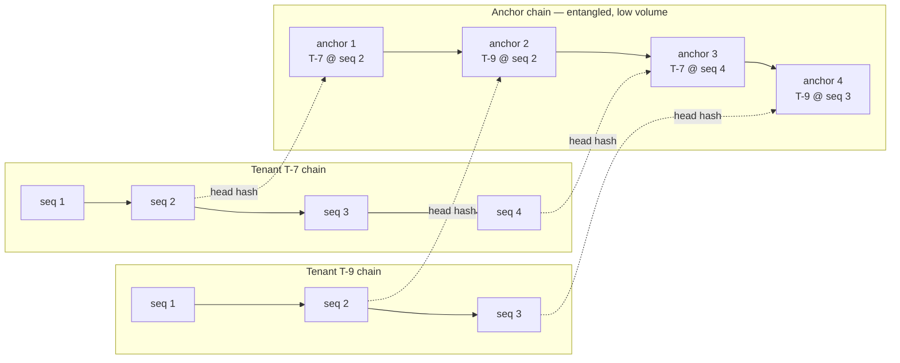

# PHASE-1-DECISIONS.md — Audit Chain Scope and Trusted Time

Analysis of the two foundational decisions that must be settled before the Execution Record core is
built, because neither can be applied retroactively.

**Status: ACCEPTED 2026-08-12.** K-3 and the L hybrid were accepted, together with the four supporting
decisions in §7. Recorded in `docs/DECISIONS.md` as **D20** (chain scope), **D21** (trusted time),
**D23** (RFC 8785 canonicalization), **D24** (SHA-256 plus algorithm identifier), **D25** (encryption key
identifier), and **D26** (non-enumerable identifiers). The amendments proposed in §5 and §6 have been
applied, with the numbering reconciled — see §8.

**Covered:** K — audit chain scope · L — trusted timestamp source and clock-skew handling.

**Why these cannot wait.** The chain begins at the first audit record; history written before the scope
is settled cannot be re-chained. Timestamps written under an undisciplined clock are permanently
unreliable, and both `PRODUCT.md` §24 and `DECISIONS.md` D14 make the audit record the product's
central claim.

---

## 1. Two findings that shape both decisions

Working through K and L surfaced two points that are prerequisites for either analysis. Both apply to
every option below.

### 1.1 Hash chaining alone does not defeat a determined operator

A hash chain detects **modification of a record in the middle of the chain**, because every subsequent
hash changes. It does **not** detect:

- **Truncation** — deleting the most recent N records. The remaining chain still verifies perfectly.
- **Wholesale rewrite** — an operator with write access can recompute every hash from any point
  forward. The result is internally consistent and indistinguishable from the original.

Nothing in the choice between per-tenant and global scope changes this. What defeats it is **anchoring**
— binding chain state to something the operator cannot rewrite. `DECISIONS.md` D14 already lists
external anchoring as open; this analysis shows it is not an optional refinement but the mechanism that
makes the tamper-evidence claim true. That materially changes which K option is right.

### 1.2 The hash must cover ciphertext, never plaintext

`DECISIONS.md` D1 erases data by destroying the tenant key. If a chain record's hash were computed over
the **plaintext** payload, then after key destruction the plaintext is gone and the hash can never be
recomputed — **the chain becomes permanently unverifiable for every record after the shredded one.**
Erasure would destroy auditability, which is precisely the outcome D1 exists to prevent.

The rule, therefore:

```
record_hash = H( prev_hash ‖ tenant_id ‖ seq ‖ event_type ‖ actor_id ‖ event_time ‖ H(payload_ciphertext) )
```

Every input survives key destruction. Verification works forever; only readability is lost. This makes
D1's claim that the chain "links over hashes and metadata, never over plaintext payloads" concrete, and
it is a hard constraint on all three K options.

---

## 2. Decision K — Audit chain scope

### 2.1 Option K-1 — Per-tenant chain

**How it works.** Each tenant has an independent chain. Every audit record carries `tenant_id`, a
per-tenant monotonic sequence number, and `prev_hash` pointing at that tenant's previous record. A
`chain_head` row per tenant holds the current sequence and hash; writers take a row lock on it to
serialize appends within the tenant.

**Security implications.** Tamper-evident within a tenant against mid-chain modification. Offers no
defence against truncation or wholesale rewrite of one tenant's history (§1.1) — an operator can
rewrite tenant A's chain entirely, and nothing outside it contradicts the result. Records are not
entangled with other tenants, so selective tampering against a single tenant is the easiest case.

**Tenant isolation implications.** Ideal. The chain never crosses a tenant boundary. Verification of a
tenant's chain requires only that tenant's rows, so an auditor scoped to one tenant can fully verify
what they are permitted to see. Nothing about the chain requires reading another tenant's data.

**Auditability.** Clean and self-contained per tenant. No cross-tenant ordering guarantee — you cannot
prove tenant A's event preceded tenant B's — which for this product is not a requirement anyone has.
Platform-level events with no tenant need a separate home.

**Implementation complexity: Low.** One table, one head row per tenant, one append path. The only real
care needed is serializing appends per tenant.

**Operational complexity: Low.** Write contention is scoped to a single tenant, so one tenant's close
week cannot slow another tenant's audit writes — which matters because under the recommended E-1
orchestration a state transition and its audit record share a transaction, making chain contention
directly into transition contention. N chains to verify rather than one, but each is small.

**Tenant deletion.** Clean. Destroy the tenant key: payloads become unreadable, chain structure remains
verifiable per §1.2, and no other tenant is affected. If a tenant's rows were ever hard-deleted, only
that tenant's chain is affected.

**Record redaction.** Nothing to do. D12 requires redaction *before* persistence, so a stored record was
never unredacted. There is no "redact later" operation, because that would break the chain by
definition. If something slips through redaction, the only remedy is key destruction — which is exactly
the D1/D14 reinforcement already noted in `DECISIONS.md`.

**With PostgreSQL RLS.** Perfect fit. A standard `tenant_id` policy covers the audit table like any
other. Verification runs entirely inside the tenant's RLS scope. No `BYPASSRLS` role is required for
normal operation, which is important because M-1 explicitly withholds that privilege from the
application role.

**Advantages.** Simplest to build and operate · strongest isolation story · no cross-tenant contention ·
verification is cheap and tenant-scoped · straightforward tenant offboarding.

**Disadvantages.** No protection against truncation or rewrite · no cross-tenant ordering · platform
events need a separate chain · N chains to monitor.

### 2.2 Option K-2 — Global chain

**How it works.** One chain across the entire platform. Every audit record links to the globally
previous record regardless of tenant, with a single global sequence and a single head row.

**Security implications.** The one genuine advantage: **mutual entanglement.** Because tenants'
records interleave, rewriting tenant A's history requires recomputing every subsequent record including
other tenants' — so selective tampering against one tenant becomes much harder. Truncation and
wholesale rewrite from the head remain possible without anchoring.

**Tenant isolation implications.** This is where it fails. Verifying the chain requires reading records
across tenants. Under RLS a tenant's auditor sees only their own rows, so they observe sequence gaps and
**cannot recompute `prev_hash` for records they cannot read** — they cannot verify at all. The
workarounds are both bad:

- A `BYPASSRLS` verification role — precisely the privilege M-1 forbids, and a standing cross-tenant
  read path.
- A cross-tenant-readable "chain skeleton" of sequence numbers, hashes, and timestamps. This leaks the
  existence, volume, and timing of every other tenant's activity. For a compliance product whose
  customers are competitors in the same industry, inferring a rival's close-cycle schedule from
  metadata is a real confidentiality failure, not a theoretical one.

It also conflicts structurally with D15's rule that no query joins across tenants.

**Auditability.** Strongest possible ordering guarantee; weakest tenant-scoped verifiability. The
product needs the second far more than the first.

**Implementation complexity: Medium–High.** A global serialization point, plus solving the
tenant-verification problem, which is a design sub-project of its own.

**Operational complexity: High.** Every audit write across all tenants serializes on one head row — and
because audit writes share a transaction with state transitions, that becomes a platform-wide
serialization point on every transition. At MVP scale (roughly 100–300 audit writes per second at peak)
PostgreSQL can sustain it, so this is coupling rather than a throughput wall — but it couples all
tenants together at exactly the moment `PRODUCT.md` §15 says load spikes.

**Tenant deletion.** Poor. A departing tenant's records remain interleaved in a shared structure
permanently; they can never be removed without breaking every other tenant's chain. Crypto-shredding
makes them unreadable, which is defensible, but "your data structurally remains inside a shared record
we can never remove" is a procurement conversation you do not want to have.

**Record redaction.** Same as K-1 — nothing to do, redaction precedes persistence.

**With PostgreSQL RLS.** Poor fit, for the reasons above. This alone is close to disqualifying given
D15 and M-1.

**Advantages.** Total ordering across the platform · mutual entanglement makes selective tampering
harder · a single chain to verify.

**Disadvantages.** Tenants cannot verify their own chain without a cross-tenant read path or a metadata
leak · conflicts with RLS and D15 · platform-wide write coupling · unclean offboarding.

### 2.3 Option K-3 — Per-tenant chain anchored into a global chain

**How it works.** Two layers.

1. **Tenant layer** — exactly K-1. Independent per-tenant chains.
2. **Anchor layer** — a separate, low-volume, hash-chained table. On a fixed cadence (every N records or
   every T minutes, whichever comes first), a scheduler job writes one anchor row per active tenant
   containing `(tenant_id, tenant_seq, tenant_head_hash, anchor_time)`. Each anchor row links to the
   previous anchor row **across all tenants**, so the anchor chain is itself entangled.



**Security implications. The strongest of the three, and the only one that delivers what D14 promises.**
Rewriting tenant T-7's history past its last anchor changes T-7's head hash, which no longer matches the
anchor row. Rewriting the anchor row to match requires recomputing every subsequent anchor — including
anchors belonging to other tenants. Entanglement is preserved where it is useful (the anchor layer)
without putting tenant records into a shared chain. Truncation of a tenant chain back past an anchor is
likewise detected.

It is also the natural path to external notarization: the anchor chain is tiny, so publishing or
timestamping its head periodically is cheap — and that is the step that finally defeats an operator with
full database access. Designed for now, deferred to post-MVP.

**Tenant isolation implications.** The tenant layer is K-1 and inherits its perfect isolation. The anchor
layer holds only `tenant_id`, sequence, hash, and time — no payload, no event detail. It is **not
tenant-readable**; access is restricted to the platform and `auditor` roles. A tenant verifies their own
chain against anchor rows filtered to their own `tenant_id`; verifying the anchor chain's own integrity
end to end is a platform or external-auditor operation.

The residual leak is confined to that restricted layer: an auditor with full access can see which
tenants were active at which anchor intervals. If that matters, storing a per-tenant salted pseudonym
instead of `tenant_id` in anchor rows removes it. Worth noting; probably unnecessary at MVP.

**Auditability.** Best of the three. Tenant-scoped verification, plus detection of truncation and
rewrite, plus cross-tenant ordering at anchor granularity — which is all the cross-tenant ordering
anyone actually needs. An export for an external auditor bundles the tenant's chain, the anchor rows
covering it, and the anchor chain's integrity proof.

**Implementation complexity: Medium.** K-1 plus one small table, one scheduled job, and a
two-level verification routine. The scheduler already exists under E-1, so no new infrastructure.

**Operational complexity: Low–Medium.** Per-tenant write contention as in K-1, plus a low-volume anchor
writer whose cadence is a tunable knob trading anchoring latency against write volume.

**Tenant deletion.** Clean. Destroy the tenant key; the tenant chain becomes unreadable but verifiable;
anchor rows contain only hashes and remain valid. No other tenant is affected and no shared structure
needs rewriting.

**Record redaction.** Same as K-1.

**With PostgreSQL RLS.** Good fit. The tenant chain takes the standard policy. The anchor table is
platform-scoped with its own restrictive policy, denied to tenant roles. No `BYPASSRLS` needed for
tenant-scoped verification.

**Advantages.** Delivers real tamper-evidence rather than the appearance of it · preserves tenant
isolation completely at the record layer · clean offboarding · evolves naturally to external
notarization · anchor cadence is a tunable operational knob.

**Disadvantages.** Two chains to implement and verify instead of one · anchor cadence introduces a
detection window — tampering within the current interval is invisible until the next anchor · a small
amount of activity metadata in the restricted anchor layer.

### 2.4 Comparison

| | K-1 Per-tenant | K-2 Global | K-3 Anchored |
|---|---|---|---|
| Detects mid-chain modification | Yes | Yes | Yes |
| Detects truncation / rewrite | **No** | No | **Yes**, past last anchor |
| Tenant can verify own chain | Yes | **No** | Yes |
| Works with RLS without `BYPASSRLS` | Yes | **No** | Yes |
| Cross-tenant write coupling | None | **All tenants** | None |
| Clean tenant offboarding | Yes | **No** | Yes |
| Path to external notarization | Weak | Weak | **Direct** |
| Implementation | Low | Medium–High | Medium |
| Operations | Low | High | Low–Medium |

### 2.5 Recommendation — K-3

**Adopt per-tenant chains anchored into an entangled global anchor chain.**

The decisive argument is §1.1: plain hash chaining, at any scope, does not defeat the realistic threat.
`PRODUCT.md` §24 states that no role including `platform_admin` can alter the audit record, and D14
claims tamper-evidence. Only anchoring makes those statements true rather than aspirational, and for a
product whose thesis is "designed by people who expect to be audited," shipping the appearance of
tamper-evidence would be the worst available outcome.

K-2 is disqualified on tenant isolation. It cannot be verified by a tenant without either a standing
cross-tenant read path that M-1 forbids, or a metadata leak that lets competing customers infer each
other's activity.

**On cost and sequencing.** K-3's tenant layer *is* K-1, byte for byte. The anchor layer is one small
table plus one scheduled job on infrastructure E-1 already requires. It can therefore be delivered in
two steps inside Phase 1 — tenant chains first, anchoring second — **with zero rework**, because the
record format does not change. If Phase 1 runs tight, shipping the tenant layer first and anchoring
before the phase closes is an acceptable sequence. Shipping K-1 and calling Phase 1 done is not, because
the unanchored window is permanently unverifiable.

**Also required by this choice:**

- **A platform chain** for events with no tenant — configuration changes, tenant provisioning,
  break-glass access — using a reserved system tenant identity, anchored identically.
- **Dual recording for cross-boundary events.** A platform administrator's break-glass access to tenant
  T is written to both the platform chain and tenant T's chain, so the tenant's own record shows it.

---

## 3. Decision L — Trusted timestamps and clock skew

### 3.1 The framing that resolves most of this

**Order and time are different guarantees, and conflating them is the classic mistake.**

- The **chain sequence number** is the authoritative order of events. It is exact, gap-free, and
  independent of any clock.
- The **timestamp** is evidence of *when*, and is inherently approximate.

Once separated, the requirement on timestamps drops sharply. We do not need perfectly monotonic
timestamps to establish ordering — the chain does that. We need timestamps that are single-sourced,
disciplined, and defensible to an auditor.

### 3.2 Option L-1 — Application server timestamps

**How generated.** Each API process and each worker reads its own host clock at write time.

**Clock skew.** The fatal problem. Under D3 and E-1 the API and worker pools are horizontally scaled
across hosts, each with an independent clock. NTP typically holds hosts within tens of milliseconds, but
virtualized hosts drift further under steal time, suspension, or misconfiguration. Two causally ordered
events written by different processes can receive contradictory timestamps.

**Ordering.** Unreliable across processes. Timestamps can disagree with actual causality.

**Worker/server differences.** This *is* the problem: the API writes some audit records and workers
write most of them, from different hosts.

**Audit implications.** Severe. An auditor who finds "the approval is timestamped before the artifact it
approved" has a legitimate basis to reject the entire record. The credibility cost is not proportional
to the size of the skew.

**Security implications.** Anyone with host access can set an arbitrary time. Worst attestation of the
five.

**Implementation complexity.** Trivial — its only advantage.

### 3.3 Option L-2 — PostgreSQL `clock_timestamp()`

**How generated.** The database server's clock, evaluated at the moment the expression executes;
changes within a single statement.

**Clock skew.** Substantially solved: **one clock, one host.** All writes pass through a single primary,
so there is no skew *between writers* — the hardest kind to reason about. Skew against true UTC remains,
but it is one host to discipline instead of N.

**Ordering.** Near-monotonic in practice, with two caveats: concurrent statements can produce equal
values, and an NTP step correction can move the clock backwards. Both are handled by §3.1 — the sequence
number carries the order.

**Worker/server differences.** Eliminated. Workers never supply the time.

**Audit implications.** Strong and simple to state: "every timestamp comes from the database server's
disciplined clock."

**Security implications.** Manipulation requires database server access, a much smaller surface than any
application host.

**Implementation complexity.** Low, but requires discipline: application code must never supply a
timestamp for an audit record. The value must come from a column default or an insert-time expression.

### 3.4 Option L-3 — `transaction_timestamp()`

**How generated.** The same database clock, captured at **transaction start** and constant for the whole
transaction. (`now()` and `CURRENT_TIMESTAMP` are equivalent to this in PostgreSQL.)

**Clock skew.** Identical to L-2 — same clock, same host.

**Ordering.** Two overlapping transactions can commit in a different order than their start timestamps
suggest. Under §3.1 this is harmless, because the sequence number is assigned at append time under the
chain-head lock and therefore reflects true append order.

**Worker/server differences.** Eliminated, as L-2.

**Audit implications.** Semantically better than L-2 for our design. Under E-1 a state transition and
its audit record are written in **one transaction**; giving them one shared timestamp correctly says
"this transition happened at time T," rather than two sub-millisecond-apart values that imply a
precision the system does not have.

The one weakness: a long transaction records its *start* time, which misrepresents when later writes
occurred. Our transactions are designed to be short, and a long-transaction alert covers the rest.

**Security implications.** Same as L-2.

**Implementation complexity.** Low, same discipline as L-2.

### 3.5 Option L-4 — Trusted external time source

**How generated.** An RFC 3161 timestamp authority, or equivalent, cryptographically signs a hash
together with an attested time.

**Clock skew.** Eliminated as a trust question — the time is attested by a party outside the platform.

**Ordering.** Not improved; the chain still carries order.

**Audit implications.** The strongest possible: a time the platform operator cannot forge. This is what
non-repudiation against the operator actually requires.

**Security implications.** The only option that defends against a malicious operator backdating records.

**Implementation complexity. High, and infeasible per record.** A network round trip for every audit
write is impossible at hundreds of writes per second, introduces an external availability dependency in
the write path — if the authority is down, do audit writes block or proceed unattested? — and costs
money per timestamp.

**But it composes perfectly at the anchor layer.** Under K-3 the anchor chain is tiny: one row per
active tenant per interval. Notarizing **anchor heads** rather than individual records gives attested
time for the entire chain at negligible cost and with no dependency in the hot write path. This is the
natural evolution, and it is why K-3 and L are entangled decisions.

### 3.6 Option L-5 — Hybrid

**How generated.** Layered, each source used for what it can honestly support:

| Layer | Source | Meaning |
|---|---|---|
| Event order | Chain sequence number | **Authoritative order** |
| Event time | PostgreSQL `transaction_timestamp()` | **Authoritative time**, single disciplined clock |
| Reported times | Values inside tool output and external API receipts | **Observational only**, stored as evidence content, never as platform event time |
| Attested time | External notarization of anchor heads | **Deferred**, designed for now |

**Clock skew.** One clock to discipline. Chrony configured to slew rather than step, so the clock never
jumps backwards. Offset monitored and alerted; the observed offset written periodically as a platform
audit event, so an auditor can see the clock was under discipline throughout.

**Ordering.** Carried by the sequence, immune to clock behaviour.

**Worker/server differences.** Removed entirely — no application host contributes a platform timestamp.

**Audit implications.** Defensible and simple to explain, with a clear upgrade path to attested time
without changing the record format.

**Security implications.** Manipulation requires database server access. Backdating by a malicious
operator remains possible until anchor notarization lands — stated honestly rather than papered over.

**Implementation complexity. Low–Medium.** The only new mechanisms are a monotonicity assertion at
append time and clock-offset monitoring.

### 3.7 Recommendation — L-5, concretely L-3 plus guards

**Adopt the hybrid, with `transaction_timestamp()` as the authoritative platform event time.**

Specifically:

1. **All audit and evidence timestamps come from PostgreSQL `transaction_timestamp()`.** Application
   code never supplies a timestamp for a platform event. Enforced by column default and reviewed as a
   security control.
2. **`timestamptz` everywhere; UTC at rest**, per `PRODUCT.md` §22. Never `timestamp` without zone.
3. **The chain sequence number is the authoritative order.** Documented as such, and used by the console
   and any export for ordering — never the timestamp.
4. **Monotonicity assertion at append.** The chain writer asserts the new record's timestamp is not
   earlier than the previous record's for that chain. A violation is **recorded as an integrity
   anomaly**, not silently accepted and not silently rejected. This cheaply catches a clock step, a
   failover to a host with a different clock, or a misconfiguration.
5. **Clock discipline as an operational requirement.** Chrony with slewing on the database host; offset
   monitored; a periodic platform audit event recording observed offset.
6. **External times are content, not time.** A tool result containing an external system's timestamp is
   stored as evidence payload and clearly labelled as reported, never promoted to the platform's event
   time. `PRODUCT.md` §16 already treats external payloads as data; this extends it to time.
7. **SLA computation uses the same clock.** D7's 72-hour approval window is measured with
   `transaction_timestamp()`, so the deadline a user sees and the deadline the scheduler enforces cannot
   diverge.
8. **External notarization of anchor heads is designed for and deferred**, with no record-format change
   required to adopt it later.

**Why this and not the others.** L-1 is disqualified: multi-host skew in a system where timestamps are
evidence is a credibility failure waiting to be found by the first auditor who looks. L-4 is correct
but infeasible per record and unnecessary once §3.1 separates order from time — and it returns at the
anchor layer where it is cheap. Between L-2 and L-3, `transaction_timestamp()` wins because under E-1 a
transition and its audit record share a transaction and should therefore share one honest timestamp
rather than two that imply false precision.

---

## 4. Recommended K and L — both accepted

**K — Per-tenant chains anchored into an entangled global anchor chain (K-3).** Deliverable in two
steps inside Phase 1 with no rework, because the tenant layer is identical to K-1.

**L — Hybrid (L-5): PostgreSQL `transaction_timestamp()` as authoritative event time, chain sequence as
authoritative order, monotonicity assertion, disciplined single clock, external times stored as
observational content, anchor notarization deferred.**

The two are connected: K-3's anchor layer is what makes external attested time affordable later, so
adopting K-3 keeps L's strongest upgrade available at negligible cost.

---

## 5. Exact changes that would eventually be needed in `docs/DECISIONS.md`

Not applied. Presented so the edit is unambiguous when approved.

### 5.1 Add two new decision entries, after D15

**`## D16 · Audit chain scope — per-tenant chains anchored into a global chain`**

- **Decision.** Each tenant has an independent hash chain. A separate low-volume anchor chain records
  each tenant chain's head hash on a fixed cadence; anchor rows are themselves chained across all
  tenants. A reserved platform chain covers events with no tenant. Cross-boundary events such as
  break-glass access are written to both the platform chain and the affected tenant's chain.
- **Why.** Hash chaining alone detects mid-chain modification but not truncation or wholesale rewrite;
  anchoring is what makes D14's tamper-evidence claim true. A single global chain cannot be verified by
  a tenant without a standing cross-tenant read path that D15 and M-1 forbid, or a metadata leak
  revealing other tenants' activity.
- **Affects.** Audit table design · chain append path and per-tenant serialization · the anchoring
  scheduler job · verification and export tooling · tenant offboarding · the path to external
  notarization.
- **Remains open.** Anchor cadence, which trades detection window against write volume · whether anchor
  rows store `tenant_id` or a salted pseudonym · when external notarization is adopted · who runs
  verification and how often.
- **Reversibility. Low.** Chain scope cannot be changed retroactively. Adding anchoring later is
  additive and does not alter the record format; changing the tenant-scope decision is not.

**`## D17 · Trusted time — database transaction timestamps with order carried by the chain`**

- **Decision.** Platform event time is PostgreSQL `transaction_timestamp()`; application hosts never
  supply a platform timestamp. The chain sequence number is the authoritative order of events. A
  monotonicity assertion at append records any backwards time movement as an integrity anomaly. The
  database host's clock is disciplined with slewing and its offset monitored and periodically recorded.
  Times reported by tools or external systems are stored as evidence content, never promoted to platform
  event time. External notarization of anchor heads is deferred.
- **Why.** Multi-host application clocks skew, and a record whose timestamps contradict causality is
  challengeable in full. Separating order from time removes the need for perfectly monotonic timestamps.
  Per-record external attestation is infeasible in the write path but becomes cheap at the anchor layer
  introduced by D16.
- **Affects.** Every audit and evidence write · SLA computation under D7 · export and console ordering ·
  database host operational requirements · evidence payload handling.
- **Remains open.** Notarization provider and cadence · behaviour on failover to a host with a divergent
  clock, beyond recording the anomaly · whether integrity anomalies page immediately or are batched.
- **Reversibility. Low** for records already written; **High** for adding attestation later.

### 5.2 Amend `D14 · Audit — append-only and hash-chained`

Under **Remains open**, replace the bullet beginning *"Chain scope — global versus per-tenant"* with:
**Resolved by D16.** Replace the bullet beginning *"Trusted time"* with: **Resolved by D17.**

Retain the bullets on external anchoring, verification cadence and ownership, and retention expiry
versus chain integrity — D16 makes external anchoring cheaper but does not adopt it.

### 5.3 Amend the reversibility summary table

Add two rows:

| D16 | Audit chain scope — per-tenant anchored | **Low** |
| D17 | Database transaction timestamps, chain-carried order | **Low** for written records |

### 5.4 Amend `## Cross-decision tensions`

Tension **3** (*"D14 × D15 — chain scope versus isolation"*) is **resolved by D16**; rewrite it as a
resolved note rather than deleting it, so the reasoning survives.

Add a new tension: **D16 × D1 — the chain must hash ciphertext, not plaintext.** If a record's hash
covered plaintext, destroying a tenant key would render every subsequent record unverifiable, and
erasure would destroy auditability. The hash covers `H(payload_ciphertext)` plus metadata, all of which
survive key destruction.

---

## 6. Exact changes that would eventually be needed in `docs/ARCHITECTURE.md`

Not applied.

### 6.1 §3 Architectural invariants — add two rows

| I11 | The chain sequence number, not the timestamp, is the authoritative order of events. | D17 |
| I12 | A chain record's hash covers the ciphertext digest and metadata, never plaintext, so verification survives key destruction. | D1, D16 |

### 6.2 §21 Audit system — replace the two OPEN DECISION paragraphs

Delete **OPEN DECISION K** and **OPEN DECISION L**. Replace with a short *Chain structure* subsection
stating: per-tenant chains with per-tenant sequence and head row; the anchor chain and its cadence; the
reserved platform chain; dual recording for cross-boundary events; the hash input formula from §1.2 of
this document; and `transaction_timestamp()` as event time with sequence as order.

Add to **NOT responsible for**: *"establishing event order from timestamps — order comes from the chain
sequence (I11)."*

### 6.3 §5 Domain model — add the anchor chain

Add a short subsection under §5 introducing **Chain Record** and **Anchor Record** as runtime-world
entities, and note that both are append-only and never pinned, since they describe rather than govern.
No table design.

### 6.4 §36 Open architectural decisions — remove two rows

Delete rows **K** and **L**. Add a line noting both were resolved in `docs/PHASE-1-DECISIONS.md` and
recorded as D16 and D17.

### 6.5 §37 Recommended next implementation phase — extend the scope sentence

Add the anchor chain and clock discipline to the Phase 1 scope list, and extend the proof criterion:
after driving `E-1042` end to end with stubs, **chain verification must pass for the tenant chain and
the anchor chain, and must fail as expected when a record is deliberately altered in a test.** A
tamper-detection test that actually detects tampering is the only real proof this layer works.

### 6.6 §25 Database — add one requirement line

The database host's clock is a platform dependency, not an incidental detail: disciplined with slewing,
monitored for offset, and the offset periodically recorded as a platform audit event.

---

## 7. Remaining Phase 1 decisions

Decisions that must be settled before or during Phase 1. The first two were already identified; the rest
surfaced during this analysis and are small but hard to change afterwards.

### 7.1 Resolved on 2026-08-12

| ID | Decision | Outcome |
|---|---|---|
| **D, E, M, N** | Backend, orchestration, isolation, database | **Accepted** → D16, D17, D18, D19 |
| **A** | `spreadsheet.write` in the MVP tool set | **Accepted, new workbooks only** → D22 |
| **K** | Audit chain scope | **Accepted, K-3** → D20 |
| **L** | Trusted time | **Accepted, hybrid** → D21 |
| **O** | Queue technology | **Resolved** by D17 + D19 — PostgreSQL `SKIP LOCKED`, no broker. Scheduler placement still open |
| **P** | Canonical serialization | **Accepted, RFC 8785 JCS** → D23 |
| **Q** | Hash algorithm and agility | **Accepted, SHA-256 with a recorded algorithm identifier** → D24 |
| **R** | Encryption key identifier | **Accepted** → D25 |
| **S** | Identifier format | **Accepted in principle** → D26; the specific scheme remains open |

### 7.2 Still open in Phase 1

All narrow. None blocks starting; each blocks finishing.

| ID | Decision | Note |
|---|---|---|
| **I** | Evidence inline-vs-blob threshold | Low stakes — pick a constant and tune |
| **P1** | Anchor cadence | Trades detection window against write volume |
| **P2** | `tenant_id` or salted pseudonym in anchor records | Only matters for auditor-visible metadata |
| **P5** | Scheduler as separate process or leader-elected role | Operational preference |
| **P6** | PDF rendering library | Needs a spike; Windows dependency friction is the risk |

**P3, P4, and P7 were resolved on 2026-08-12** as D27, D28, and D29, because all three are baked into
the first record written and could not wait. The four remaining are tunable at any point during Phase 1
and none blocks starting.

**Not Phase 1**, unchanged: F (Phase 2) · G (Phase 3) · H (Phase 4) · J (Phase 5) · B and C (Phase 6).

---

## 8. Acceptance record

**Accepted 2026-08-12.** The amendments proposed in §5 and §6 were applied to `docs/DECISIONS.md` and
`docs/ARCHITECTURE.md`.

**Numbering reconciled.** §5.1 proposed D16 for K and D17 for L. Because the technology decisions were
accepted in the same pass, and because K and L both depend on PostgreSQL being the engine, the recorded
order places the technology decisions first:

| Proposed here | Recorded as |
|---|---|
| D16 — audit chain scope (K) | **D20** |
| D17 — trusted time (L) | **D21** |
| — | D16 backend · D17 orchestration · D18 isolation · D19 database · D22 `spreadsheet.write` · D23–D26 supporting |

**Three mechanism gaps surfaced during the consistency check** and are recorded as cross-decision
tensions 9, 10, and 11 in `docs/DECISIONS.md`, and as invariant I13 in `ARCHITECTURE.md`:

1. **The dispatch queue must be platform-scoped**, carrying `tenant_id` as a routing field and no
   business content, because a worker cannot establish tenant context before reading the queue.
2. **Anchoring needs a separate, narrowly-privileged database role** permitted to read chain-head hashes
   only, since D18 withholds `BYPASSRLS` from the application role.
3. **The platform chain needs its own encryption key**, and cross-boundary events written to both chains
   must keep the platform copy free of tenant content — otherwise shredding a tenant key would leave
   that tenant's data readable elsewhere, silently defeating D1.

**One document inconsistency** was created by accepting A and is deliberately unresolved:
`PRODUCT.md` §11 fixes a six-tool MVP set excluding `spreadsheet.write`, and §8.3 lists gates G1–G5
without a workbook integrity check. `PRODUCT.md` was not in scope for this change and is now stale in
those two places.
